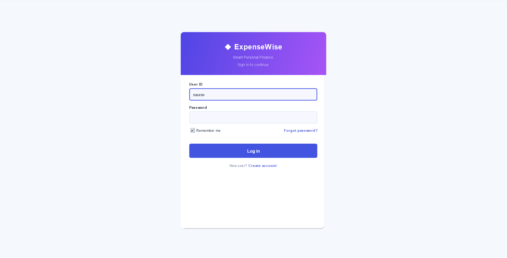
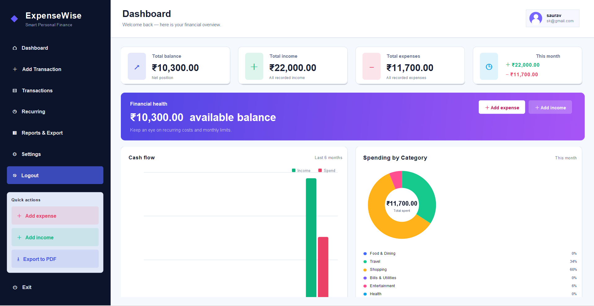
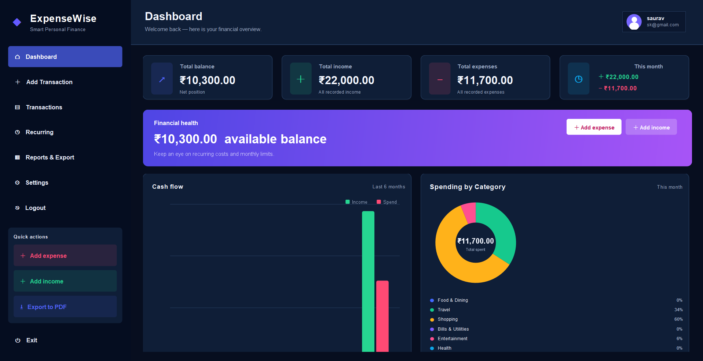
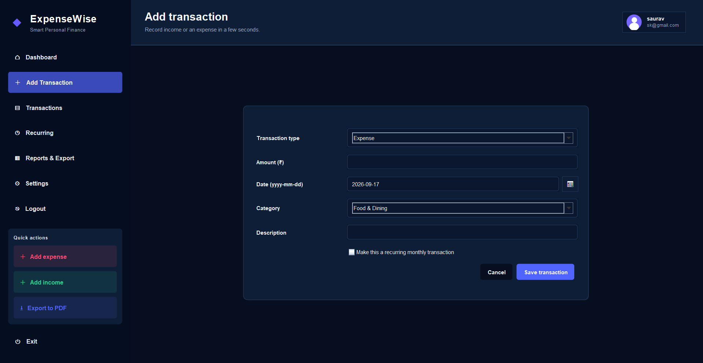
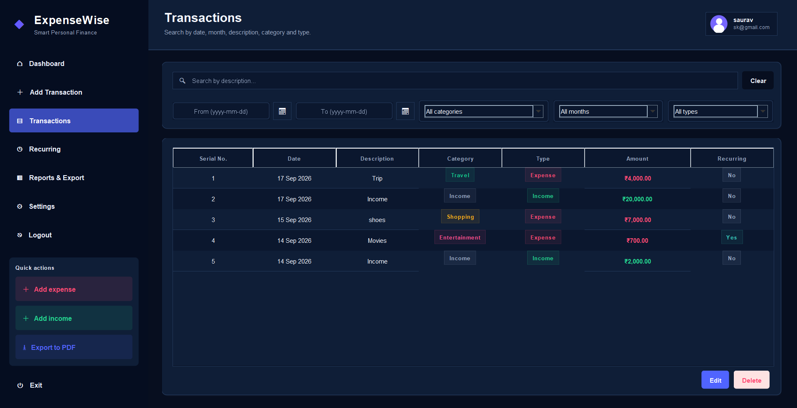
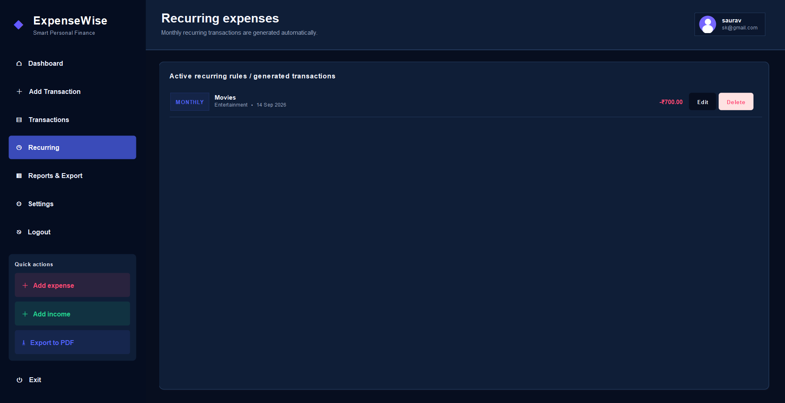
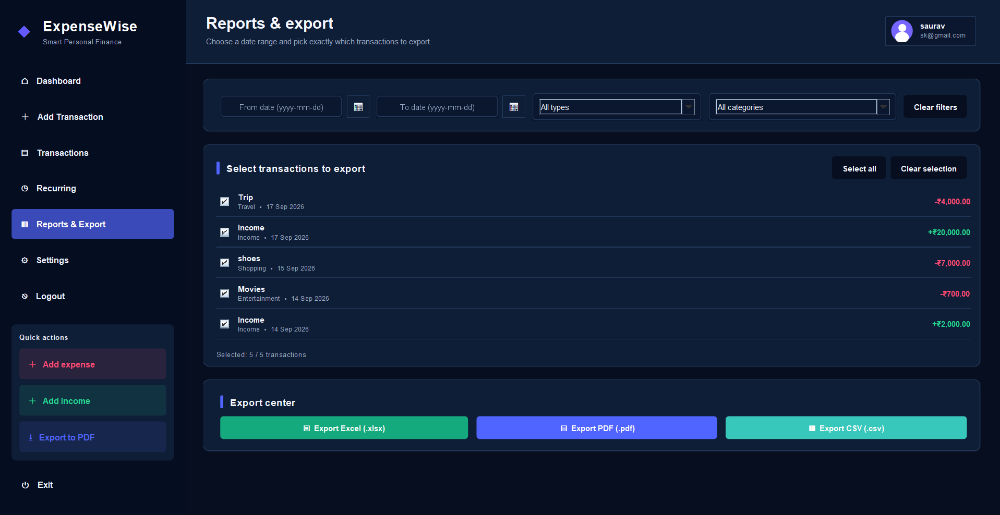
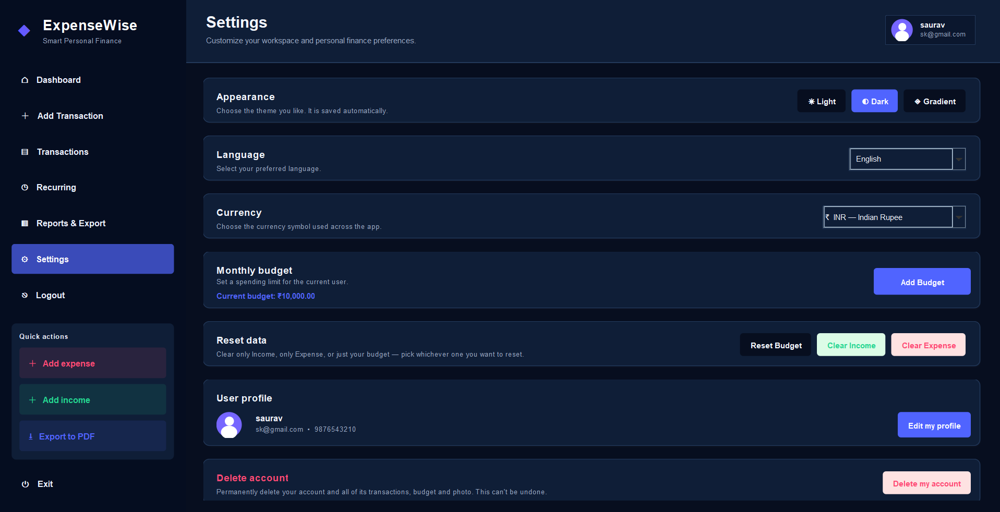
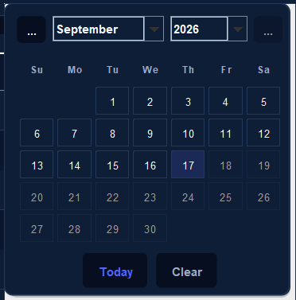
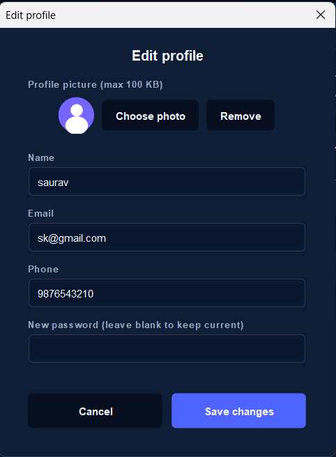

<div align="center">

# 💰 ExpenseWise

### Smart Personal Expense Manager built with Java Swing

A modern desktop application for managing personal finances, tracking transactions, monitoring spending, managing recurring expenses, generating reports, and organizing financial records through a clean and user-friendly interface.

<p>
  
  
  
  
</p>

<p>
  <b>Track • Manage • Analyze • Export</b>
</p>

</div>

---

## 📌 About the Project

**ExpenseWise** is a Java Swing-based Personal Expense Manager developed to make everyday financial tracking simple and organized.

The application allows users to record income and expenses, manage transactions, track recurring expenses, monitor budgets, analyze spending, generate reports, customize application settings, and export financial data.

The project was developed with a focus on **Java OOP, GUI development, file handling, event-driven programming, and creating a practical desktop application**.

---

## 🌟 Project Highlights

- 🖥️ Modern Java Swing desktop interface
- 📊 Interactive financial dashboard
- 💳 Complete transaction management
- ✏️ Edit and delete transactions
- 🔎 Search and filter transactions
- 🔁 Recurring expense management
- 💰 Monthly budget tracking
- 📈 Spending reports and analysis
- 📤 PDF, Excel and CSV export
- 🎨 Multiple application themes
- 🌍 Multi-language support
- 💱 Multiple currency options
- 👤 User profile management
- 📅 Calendar-based date selection
- 💾 Local data storage
- ⚙️ Custom application settings
- 🖱️ Easy-to-use sidebar navigation

---

## ✨ Features

### 📊 Dashboard

- Total balance overview
- Income summary
- Expense summary
- Monthly spending overview
- Recent transactions
- Spending visualization
- Category-wise spending
- Budget progress
- Quick actions

---

### 💳 Transaction Management

- Add income and expenses
- Transaction amount
- Transaction category
- Transaction date
- Description
- Edit transactions
- Delete transactions
- Undo recent deletion
- Search transactions
- Filter transactions
- Category filtering
- Date filtering
- Income/expense filtering

---

### 🔁 Recurring Expenses

- Add recurring transactions
- Manage monthly recurring expenses
- Edit recurring transactions
- Delete recurring transactions
- Track regular financial commitments

---

### 💰 Budget Management

- Set monthly spending limit
- Track spending against budget
- View budget progress
- Monitor budget status
- Reset budget when required

---

### 📈 Reports & Analysis

- Financial reports
- Spending analysis
- Category-wise spending
- Monthly financial overview
- Visual spending information
- Exportable reports

---

### 📤 Export Options

ExpenseWise supports exporting financial information in:

| Format | Purpose |
|---|---|
| 📄 PDF | Printable financial reports |
| 📊 Excel | Spreadsheet analysis |
| 🧾 CSV | Lightweight data sharing |

---

### 🎨 Theme Support

Choose from different application appearances:

- ☀️ Light Theme
- 🌙 Dark Theme
- 🌈 Gradient Theme

---

### 🌍 Language Support

The application provides multiple language options:

- 🇬🇧 English
- 🇮🇳 Hindi
- 🇪🇸 Spanish
- 🇫🇷 French
- 🇩🇪 German
- 🇯🇵 Japanese

---

### 💱 Currency Support

Supported currency options include:

- ₹ Indian Rupee
- $ US Dollar
- € Euro
- £ British Pound
- ¥ Japanese Yen

---

### 👤 User Profile

- User profile management
- Edit profile information
- Email and phone details
- Profile customization
- Profile image support
- Account settings

---

### 📅 Calendar

- Calendar-based date selection
- Easy date management
- Date-wise transaction organization

---

### ⚙️ Settings

Users can customize:

- Theme
- Language
- Currency
- Monthly budget
- Profile
- Application preferences

---

# 🖥️ Screenshots

## 🔐 Login



---

## ☀️ Dashboard – Light Theme



---

## 🌙 Dashboard – Dark Theme



---

## ➕ Add Transaction



---

## 💳 Transactions



---

## 🔁 Recurring Expenses



---

## 📈 Reports & Export



---

## ⚙️ Settings



---

## 📅 Calendar



---

## 👤 Edit Profile



---

# 🛠️ Tech Stack

| Technology | Purpose |
|---|---|
| ☕ **Java** | Core programming language |
| 🖼️ **Java Swing** | Desktop GUI |
| 🎨 **Java AWT** | UI components and event handling |
| 📦 **Java Collections** | Data management |
| 📅 **Java Time API** | Date and time handling |
| 💾 **File Handling** | Local data storage |
| 🖼️ **ImageIO** | Profile image handling |
| 🔐 **Java Security APIs** | Password hashing |
| 📁 **Java ZIP APIs** | Excel file generation |

---

# 🧠 Java Concepts Demonstrated

This project demonstrates practical use of:

- Object-Oriented Programming
- Classes and Objects
- Constructors
- Encapsulation
- Methods
- ArrayList
- Collections
- Event Handling
- Exception Handling
- File Handling
- Java Swing
- Java AWT
- Date & Time API
- GUI Design
- Local Data Persistence

---

# 📁 Project Structure

```text
ExpenseWise/
│
├── ExpenseWise.java
├── run.bat
├── README.md
├── .gitignore
│
└── screenshots/
    ├── 01-login.png
    ├── 02-dashboard-light.png
    ├── 03-dashboard-dark.png
    ├── 04-add-transaction.png
    ├── 05-transactions.png
    ├── 06-recurring.png
    ├── 07-reports.png
    ├── 08-settings.png
    ├── 09-calendar.png
    └── 10-edit-profile.png

---

# 👨‍💻 Developer

### Saurav Kumar

**BCA Student | Aspiring Software Developer**

Interested in:

- ☕ Java
- 🐍 Python
- 🤖 Artificial Intelligence
- 🌐 Web Development
- 💻 Software Development
- 📊 Data & Technology

---

# 📌 Project Highlights

> **ExpenseWise is more than a simple expense tracker.**

It combines **Java Swing GUI development, Object-Oriented Programming, transaction management, budgeting, recurring expenses, financial reports, data export, search & filtering, and customizable application settings** into a single desktop application.

The project demonstrates how different Java concepts and desktop technologies can be integrated to build a **practical personal finance management application**.

---

# ⭐ Support

If you find **ExpenseWise** useful or interesting, consider giving the repository a ⭐ on GitHub.

You can also:

- ⭐ Star the project
- 🍴 Fork the repository
- 💡 Suggest improvements
- 🐛 Report issues
- 🤝 Contribute to the project

---

# 📄 License

This project is created for **educational and personal development purposes**.

---

<div align="center">

### 💰 ExpenseWise

**Track • Manage • Analyze • Export**

Built with ❤️ using **Java Swing**

</div>
